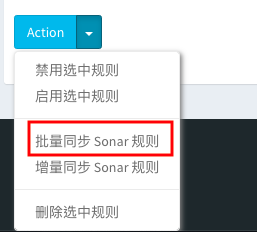

============
基础数据
============

基础数据表是必须要创建的，保证 Seecode Audit 系统正常运行的关键。

----

1. 配置信息表
==============

* 表名称： **sca_common_config**

  - ``id`` : 主键
  - ``site`` : 网站地址， 如：http://seecode-audit.com
  - ``content`` : 系统配置的自定义参数，形式为 dict
  - ``created_at`` : 创建时间

该表内容的修改是通过 Web 系统中： "系统管理" -> "系统设置" 来设置。

`PS: 默认表中只有一条数据，并且 ID 为 1。`

----

2. 扫描引擎表
==============

* 表名称： **sca_engine**

  - ``id`` : 主键
  - ``name`` : 引擎名称
  - ``module_name`` : 模块名称
  - ``enable`` : 是否开启
  - ``url`` : URL
  - ``is_customize`` : 自定义引擎
  - ``description`` : 引擎描述
  - ``whitelist_count`` : 白名单规则数
  - ``blacklist_count`` : 黑名单规则数
  - ``config`` : 引擎配置
  - ``revision`` : 修订版本
  - ``updated_at`` : 更新时间
  - ``created_at`` : 创建时间

该表内容的修改是通过 Web 系统中： "引擎管理" -> "引擎列表" 来设置。

**默认引擎，包含三个**：

.. SonarScanner :

* SonarScanner

  - ID: ``1``
  - 名称：``SonarScanner``
  - 模块名称：``seecode_scanner.lib.engines.sonarscanner``

.. RuleScanner :

* RuleScanner

  - ID: ``2``
  - 名称：``RuleScanner``
  - 模块名称：``seecode_scanner.lib.engines.rulescanner``

.. PluginScanner :

* PluginScanner

  - ID: ``3``
  - 名称：``PluginScanner``
  - 模块名称：``seecode_scanner.lib.engines.pluginscanner``

3. 同步 SonarQube 规则
========================

* 确保 SonarScanner 引擎参数配置正确

登陆 SeeCode Audit 系统后台，点击进入 "引擎管理" - "引擎列表" - "SonarScanner" 进行编辑。

.. image:: ../images/engine/engine_edit.jpg

* 同步 SonarQube 规则操作

登陆 SeeCode Audit 系统后台，点击进入 "引擎管理" - "规则策略" 拉到底部，点击 " Action" 按钮，单机 ``批量同步 Sonar 规则`` 菜单开始同步。

