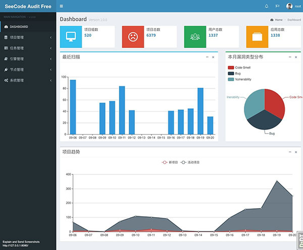

==============
Dashboard
==============

----

项目统计
===================

.. group :

* 项目组数

  - 当前系统中的项目组总数，包含线上与自定义分组

.. project :

* 项目总数

  - 当前系统中的项目总数，包含线上与离线项目

.. user :

* 用户总数

  - 当前系统中的线上系统的用户，主要为 Gitlab 中的用户

.. app :

* 应用总数

  - 创建的应用总数

----

最近扫描
===================

最近 15 天内的扫描任务统计分析。

----

本月漏洞类型分布
===================

本月的漏洞类型分布饼形图。

----

项目趋势
===================

线上项目的活动走势，分为以下两种：

* 新项目

  - 当日创建的项目数

* 活动项目

  - 当日提交代码的项目