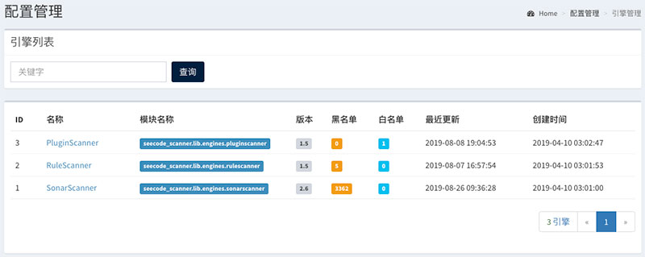
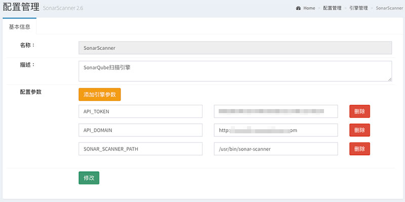
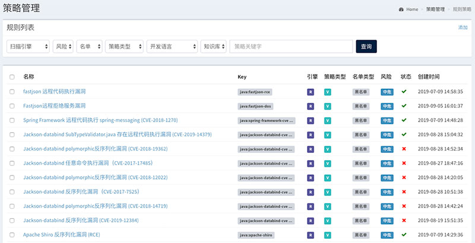
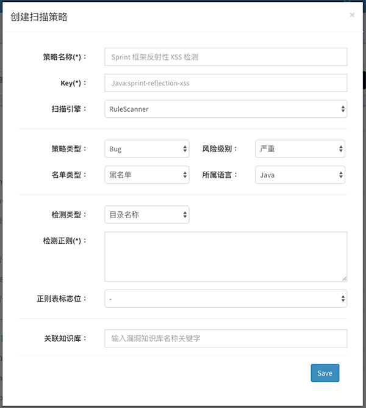
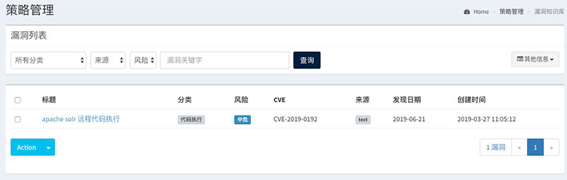
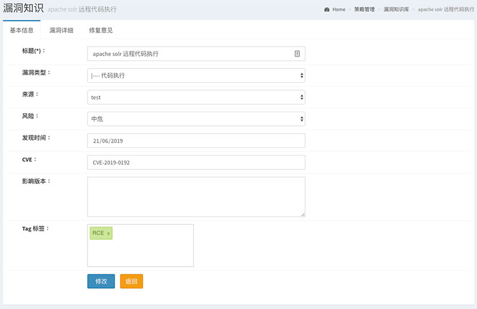
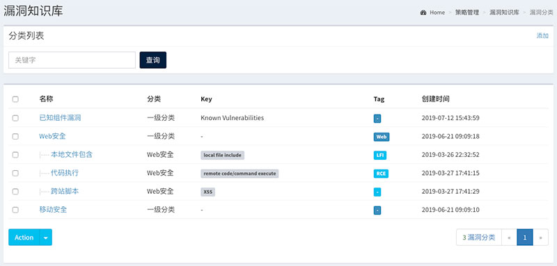
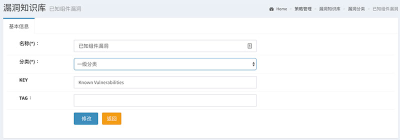

============
引擎管理
============

1. 引擎列表
==============

1.1 引擎列表
------------------

1.2 编辑引擎
------------------

----

2. 规则策略
==============

2.1 规则列表
------------------

2.2 创建规则
------------------

2.2 编辑规则
------------------

----

3. 漏洞知识
==============

3.1 知识列表
------------------

3.2 创建漏洞知识
------------------

3.3 知识库分类
------------------

3.4 编辑知识库
------------------

