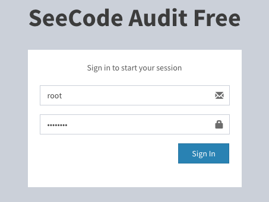

==============
登陆认证
==============

----

1. Django 认证
===================

默认使用 Django 自带认证方式，可使用 manage.py 来创建一个超级管理员。

.. code-block:: console

  $ python manage.py createsuperuser

登陆页面

----

2. SSO 认证
===================

SSO(单点登录, Single Sign-On)，确保内部存在 SSO 服务，使用 SSO 登陆，需要设置如下两个参数：

.. enable_cas_sso:

* ENABLE_CAS_SSO

  - 设置为 ``True`` ，开启 SSO。

.. cas_server_url:

* CAS_SERVER_URL

  - 设置 ``CAS_SERVER_URL``  的 SSO 登陆地址，如：``CAS_SERVER_URL = "http://sso.example.com/"``