============
项目管理
============

1. 项目组
==============

1.1 项目组列表
------------------

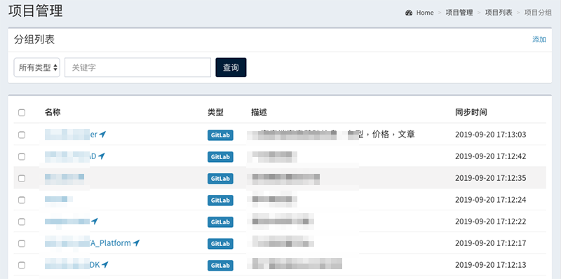

1.2 创建项目组
------------------

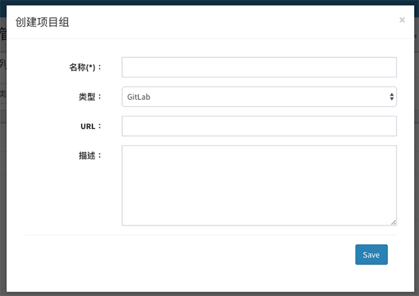

1.3 查看项目组
------------------

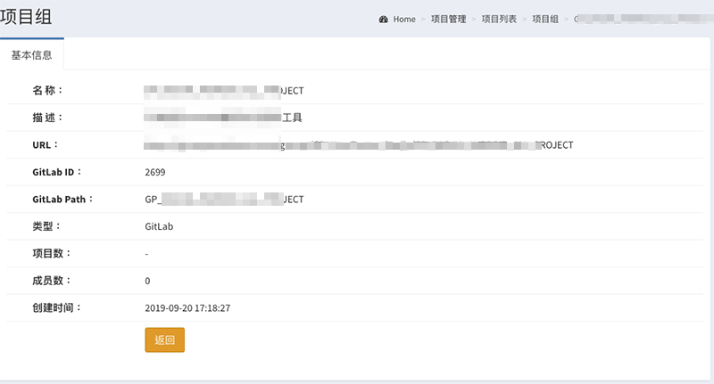

----

2. 项目
==============

2.1 项目列表
------------------

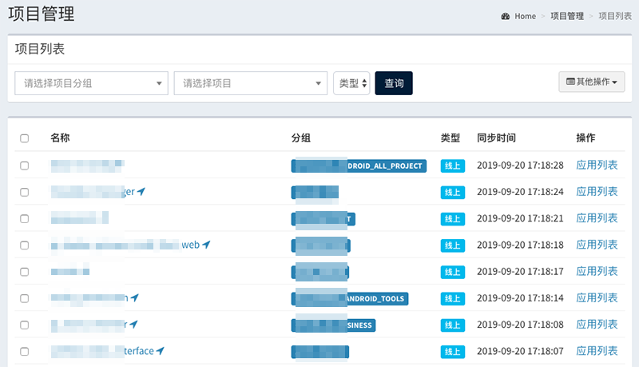

2.2 创建项目
------------------

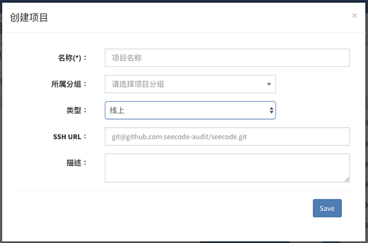

2.3 项目详情
------------------

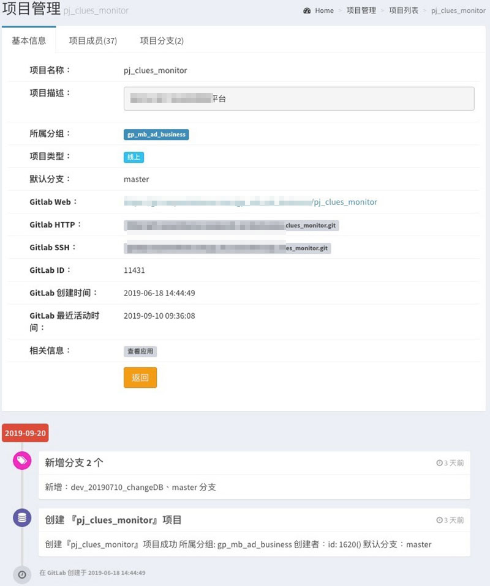

----

3. 应用
==============

3.1 应用列表
------------------

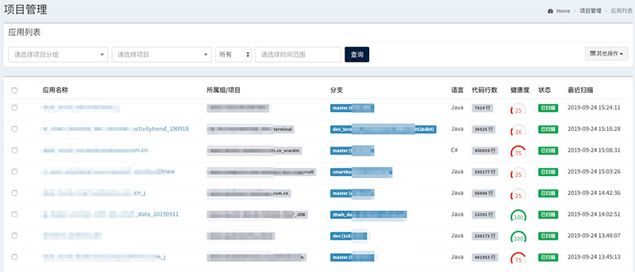

3.2 创建应用
------------------

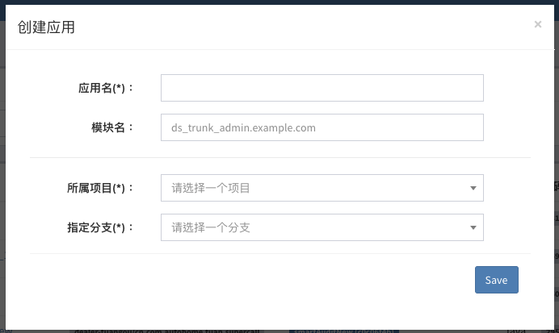

3.3 应用详情
------------------

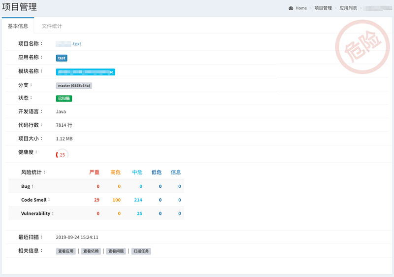

----

4. 依赖
==============

4.1 查看组件
------------------

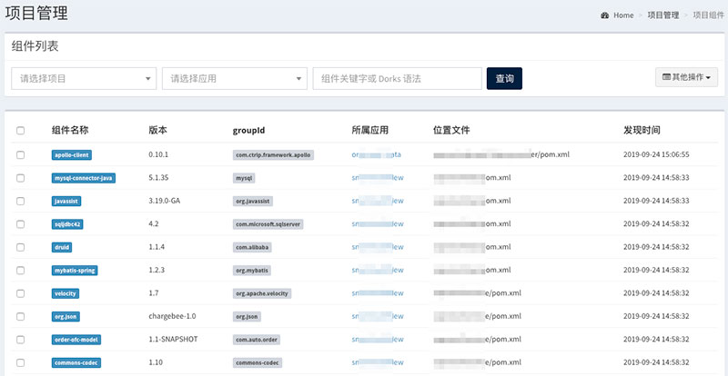

----

5. 成员
==============

5.1 成员列表查询
------------------

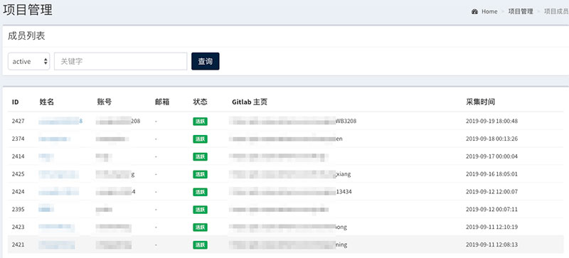
