============
任务管理
============

1. 扫描模板
==============

1.1 模板列表
------------------

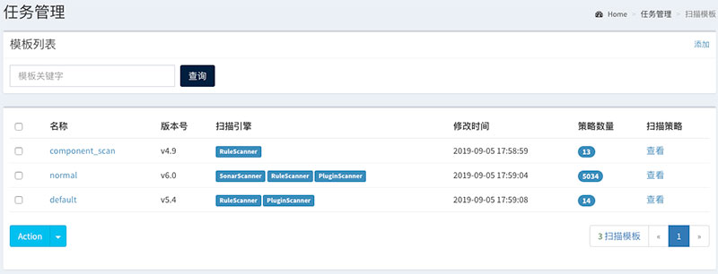

1.2 创建模板
------------------

.. image:: ../../images/scan/scan_t_add.jpg

1.3 修改模板
------------------

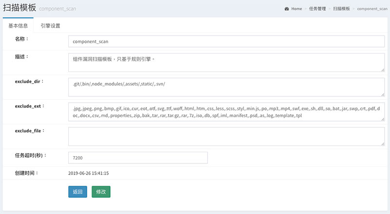

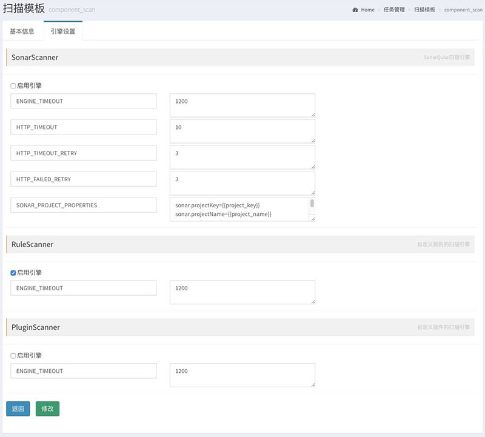

1.4 修改模板规则
------------------

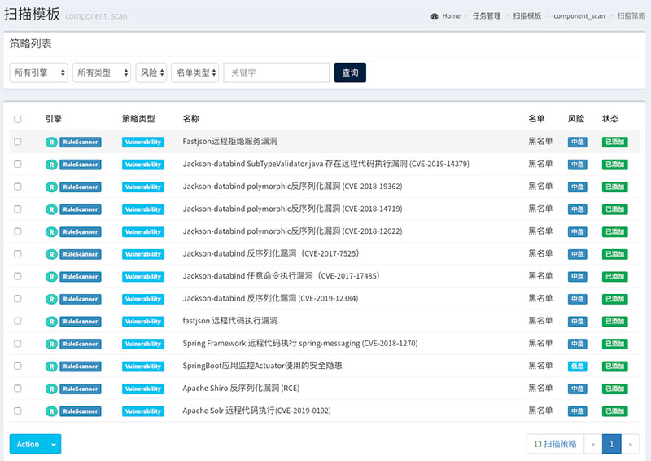

----

2. 扫描分组
==============

2.1 分组列表
------------------

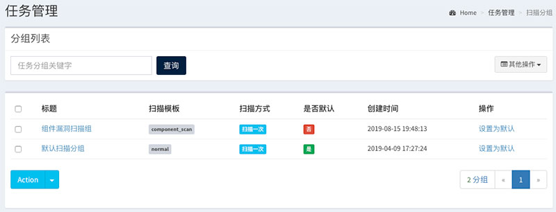

2.2 创建分组
------------------

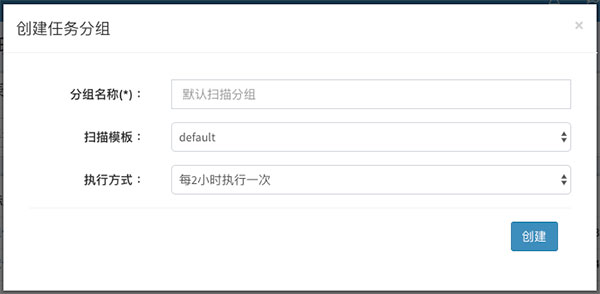

2.3 编辑分组
------------------

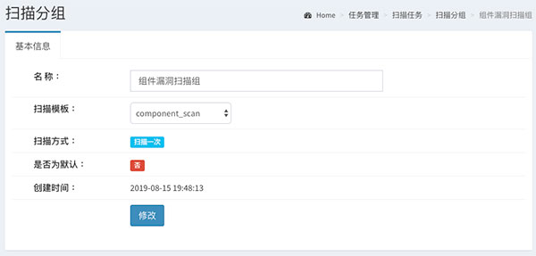

----

3. 扫描任务
==============

3.1 任务列表
------------------

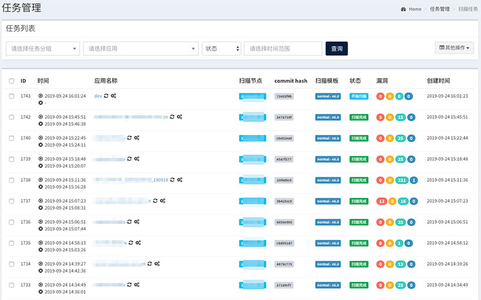

3.2 创建任务
------------------

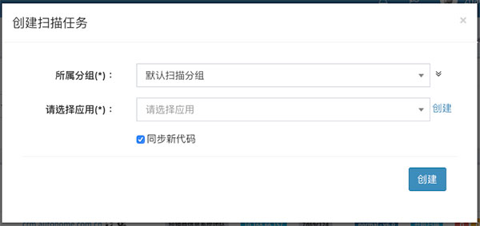

3.3 查看任务
------------------

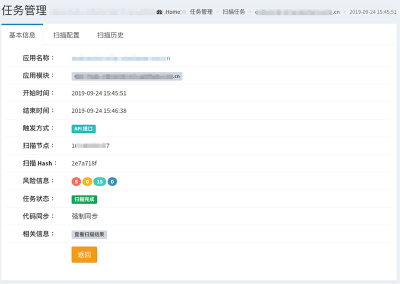

.. image:: ../../images/scan/task_show2.jpg

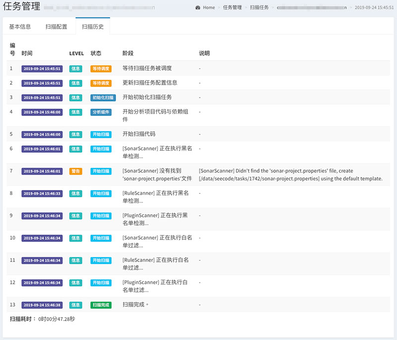

----

4. 扫描结果
==============

4.1 漏洞列表
------------------

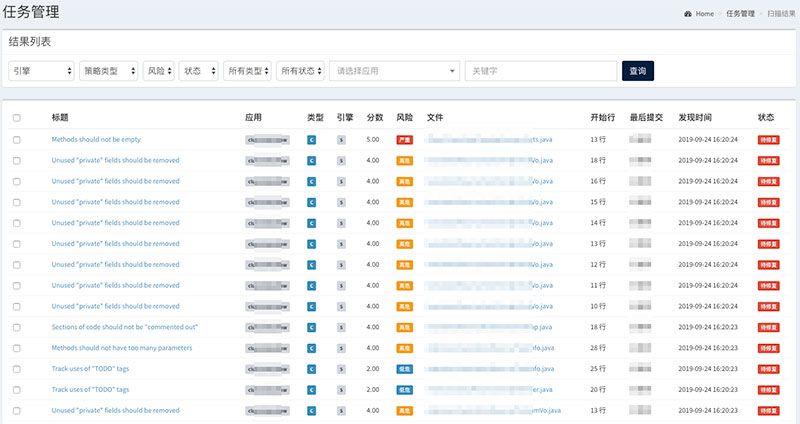

4.2 漏洞查看
------------------

.. image:: ../../images/scan/issue_show.jpg

4.3 漏洞流程
------------------

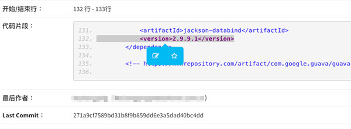

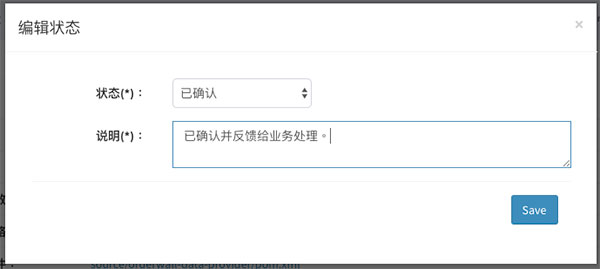

----
