============
系统管理
============

1. 账户信息
==============

1.1 分组管理
------------------

1.1.1  分组列表
^^^^^^^^^^^^^^^^^^

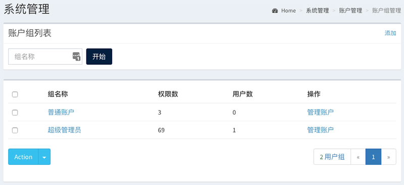

1.1.2  编辑分组
^^^^^^^^^^^^^^^^^^

.. image:: ../../images/system/user_group_edit.jpg

1.2 权限管理
------------------

1.2.1  权限列表
^^^^^^^^^^^^^^^^^^

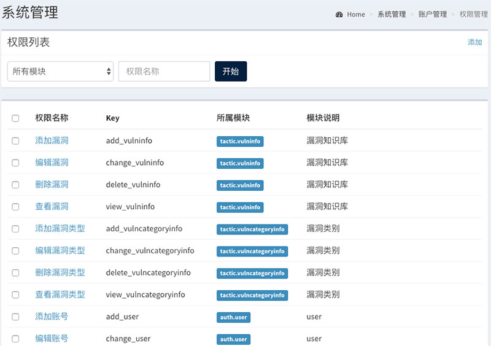

1.2.2  编辑权限
^^^^^^^^^^^^^^^^^^

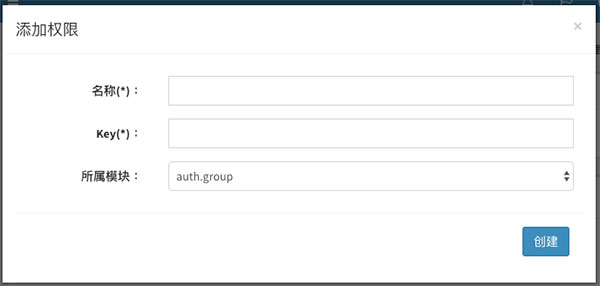

1.3 账户管理
------------------

1.3.1  权限列表
^^^^^^^^^^^^^^^^^^

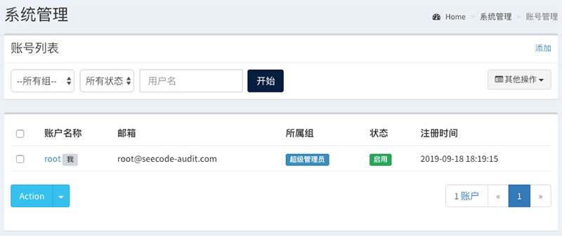

1.3.2  编辑权限
^^^^^^^^^^^^^^^^^^

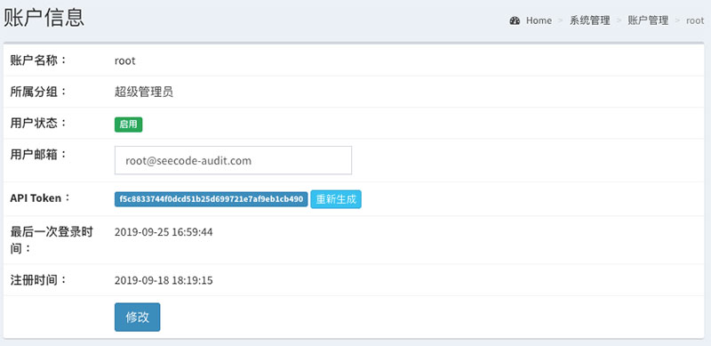

----

2. 开发语言
==============

2.1 语言列表
------------------

.. image:: ../../images/system/lang.jpg

2.2 添加语言
------------------

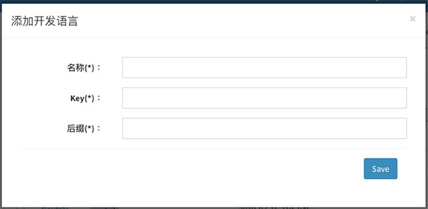

----

3. 系统设置
==============

3.1 基本设置
------------------

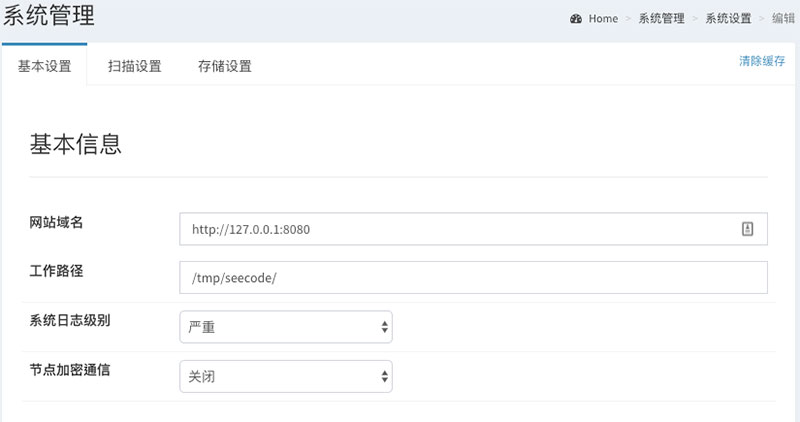

3.2 扫描设置
------------------

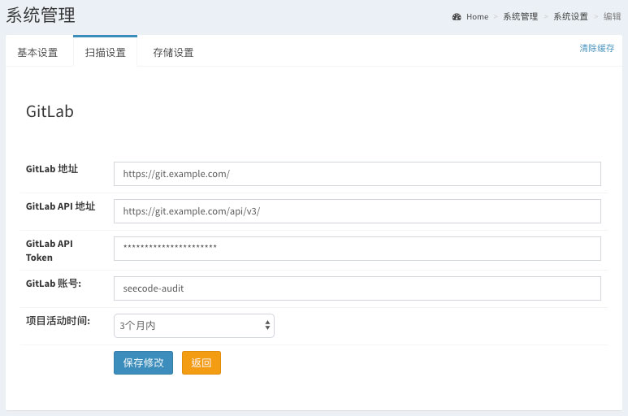

3.3 存储设置
------------------

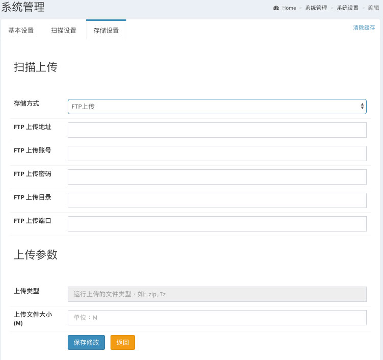

----

4. 定时任务
==============

4.1 任务列表
------------------

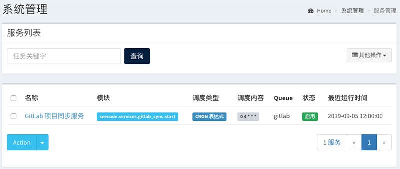

4.2 编辑任务
------------------

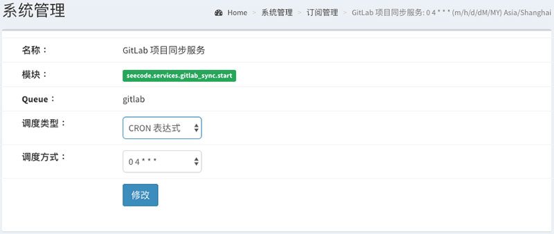

----

5. 系统日志
==============

5.1 日志列表
------------------

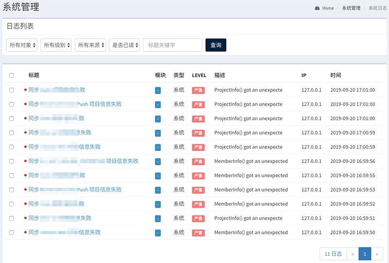

4.2 日志查看
------------------

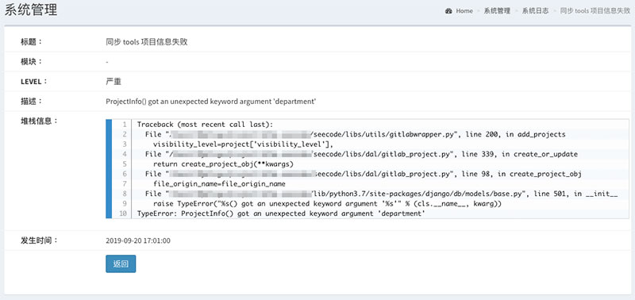
